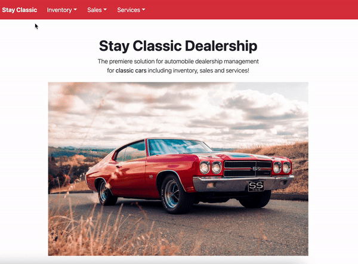
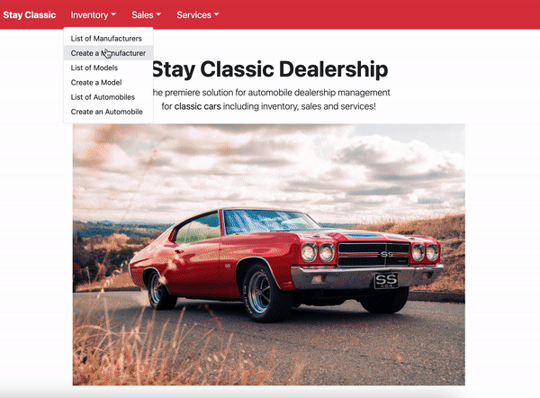
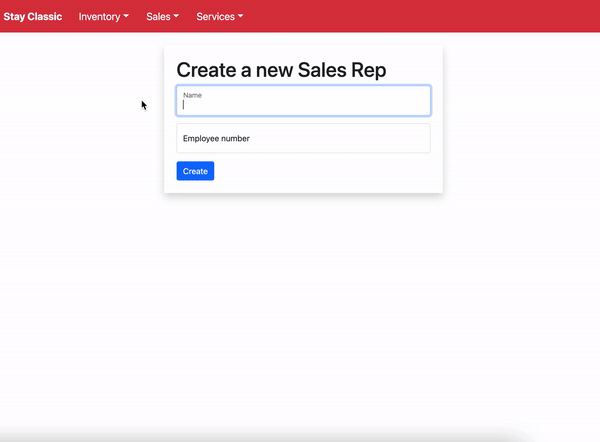
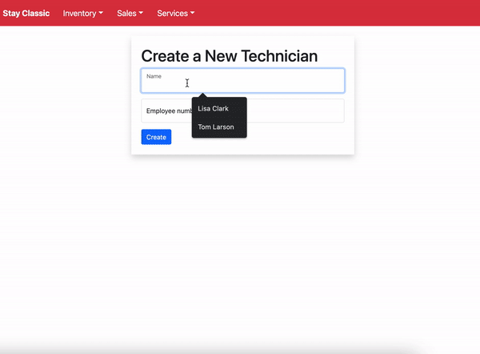
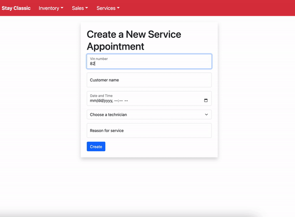

<h1 align="center">🚘&nbsp; Welcome to Stay Classic Dealership &nbsp;🚘</h1>

<p align="center">Stay Classic Dealership is a web application that has all the needs to operate a car dealership, including inventory, sales and services. </p>
<hr>

## Table of Contents 
- [Technologies Used](#technologies-used)
- [Design](#design)
    - [Team Structure](#team)
    - [Service Microservice](#service)
    - [Sales Microservice](#sale)
- [Installation/Setup](#installationsetup)
- [Application Overview](#application-overview)
- [Authors](#authors)

<hr>

## Technologies Used 
        
<br>
<br>

## Design
There are three bounded contexts: Inventory, Service and Sales.
- These bounded contexts are connected through the Automobile model in the Inventory microservice. Both sales and services needed to poll data from Automobile to use in their own microservice. 

<br>
<a name="team"></a>
<ins>Team Structure:</ins>

- Yesenia: Services microservice
- Corey: Sales microservice

<br>

<a name="service"></a>
<ins>Service microservice</ins>

The service microservice will have 3 models: AutomobileVO, Technician, Service. 

<b>AutomobileVO</b>
- The AutomobileVO model will poll data from the Inventory microservice so the Service microservice has access to the automobile's VIN. 

<b>Technician</b>
- The Technician model will allow an employee to create a technician with a name and employee number. The employee number has to be unique. 

<b>Service</b>
- The Service model will allow an employee to create a service appointment. The employee will need the car's VIN, customer name, date and time, technician completing the service, and the reason for the appointment. 

- The Service model also has two additional properties: is_vip and is_finished
    - is_vip is how the employee is able to track if an automobile was in their inventory by the automobile's VIN. The customer will receive VIP treatment on their service appointment if they bought their automobile from Stay Classic Dealership.
    - is_finished is how the completion of service is tracked. Once a service is completed then it will be shown on the Service History page.

- Service history 
    - The service history page is where all the completed services are listed. They are filtered by VINs. Once you type a VIN in the search bar, it will update the list to show which services have been completed for that automobile. If the service has not been completed yet, then it will not show up on the Service History page. 

- Cancel a service
    - You can cancel a scheduled service by clicking the cancel button, which will delete the appointment from the database. 

<br>
<a name="sale"></a>
<ins>Sales microservice</ins>

- Inside of the sales microservice, I have 4 models. My AutomobileVO model so I can poll for the car's VINs in my inventory. The SalesRep and Customer model are required before you can create a sales record. The Sales Record model is dependent on all three other models. 
- A Targeted Sales Record list is available so the employee can check the sales records of a specific sales rep. 

<br>
<hr>

## Installation/Setup
1. Install [Docker](https://docs.docker.com/get-docker/)
2. Git fork and clone this repo and navigate into the ```/stay-classic``` directory
    ```sh
    cd stay-classic
    ```
3. Create the docker volumes
    ```sh
    docker volume create beta-data
    ```
4. Docker compose build then up
    ```sh
    docker compose build 
    docker compose up
    ```

5. Create superuser by connecting to the Docker container containing the microservice<br><i>You can use the container name or the first 4 numbers of the container ID.</i>
    ```sh
    docker exec -it <container name or ID> bash
    python manage.py createsuperuser
    ```
<br>

Access the application on [http://localhost:3000](http://localhost:3000) <br>
Admin access on: <br>
&emsp; Inventory: [http://localhost:8100/admin](http://localhost:8100/admin) <br>
&emsp; Services: [http://localhost:8080/admin](http://localhost:8080/admin) <br>
&emsp; Sales: [http://localhost:8090/admin](http://localhost:8090/admin)

<br>
<hr>

## Application Overview
<div align="center">
<h3><b>Home page</b></h3>
Toggle nav bar with all the microservices separated<br>


<br>

<h3><b>Inventory</b></h3>
Manufacturer, model, and automobile create forms and list views.<br>


<br>

<h3><b>Sales</b></h3>
Sales rep, customer and sales record create forms and a list view of all the sales records sold by a specific sales rep. <br>


<br>

<h3><b>Technicians</b></h3>
Technician create form and a list view with a deactivation feature when a technician is no longer working for the company. List of service appointments filtered by technician is available as well. <br>


<br>

<h3><b>Services</b></h3>
Service appointment create form and a list view with a cancel and finished functionality. <br>
Service history list that will show all the service appointments that have been completed. 


</div>

<br>
<hr>

## Authors

👤 [**Yesenia**](https://www.yeseniar.dev): Services microservice

* Portfolio Website: [yeseniar.dev](https://www.yeseniar.dev)
* Github: [@yeseniaramirez14](https://github.com/yeseniaramirez14)
* LinkedIn: [@yeseniaramirez14](https://linkedin.com/in/yeseniaramirez14)

👤 [**Corey**](https://gitlab.com/corey.daniel.edwards): Sales microservice 